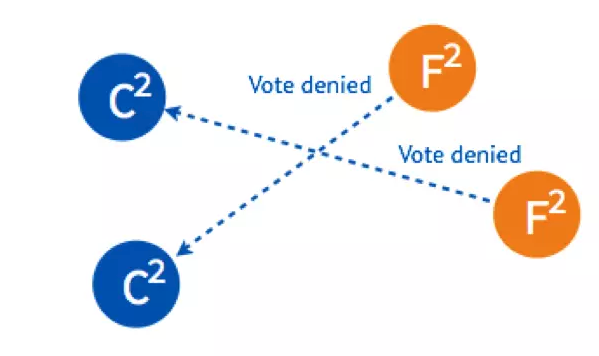
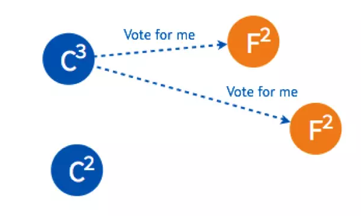

## 1. 拜占庭将军问题
> 拜占庭将军问题（Byzantine failures），是由莱斯利·兰伯特提出的点对点通信中的基本问题。含义是在存在消息丢失的不可靠信道上试图通过消息传递的方式达到一致性是不可能的。因此对一致性的研究一般假设信道是可靠的，或不存在本问题。

莱斯利·兰波特在其论文中描述了如下问题：

一组拜占庭将军分别各率领一支军队共同围困一座城市。为了简化问题，将各支军队的行动策略限定为进攻或撤离两种。因为部分军队进攻部分军队撤离可能会造成灾难性后果，因此各位将军必须通过投票来达成一致策略，即所有军队一起进攻或所有军队一起撤离。因为各位将军分处城市不同方向，他们只能通过信使互相联系。在投票过程中每位将军都将自己投票给进攻还是撤退的信息通过信使分别通知其他所有将军，这样一来每位将军根据自己的投票和其他所有将军送来的信息就可以知道共同的投票结果而决定行动策略。

系统的问题在于，将军中可能出现叛徒，他们不仅可能向较为糟糕的策略投票，还可能选择性地发送投票信息。假设有9位将军投票，其中1名叛徒。8名忠诚的将军中出现了4人投进攻，4人投撤离的情况。这时候叛徒可能故意给4名投进攻的将领送信表示投票进攻，而给4名投撤离的将领送信表示投撤离。这样一来在4名投进攻的将领看来，投票结果是5人投进攻，从而发起进攻；而在4名投撤离的将军看来则是5人投撤离。这样各支军队的一致协同就遭到了破坏。

由于将军之间需要通过信使通讯，叛变将军可能通过伪造信件来以其他将军的身份发送假投票。而即使在保证所有将军忠诚的情况下，也不能排除信使被敌人截杀，甚至被敌人间谍替换等情况。因此很难通过保证人员可靠性及通讯可靠性来解决问题。

假始那些忠诚（或是没有出错）的将军仍然能通过多数决定来决定他们的战略，便称达到了拜占庭容错。在此，票都会有一个默认值，若消息（票）没有被收到，则使用此默认值来投票。

上述的故事映射到计算器系统里，将军便成了计算器，而信差就是通信系统。虽然上述的问题涉及了电子化的决策支持与信息安全，却没办法单纯的用密码学与数字签名来解决。因为电路错误仍可能影响整个加密过程，这不是密码学与数字签名算法在解决的问题。因此计算器就有可能将错误的结果提交去，亦可能导致错误的决策。

## 2. Raft算法
> 将拜占庭将军问题根据常见的工作上的问题进行简化：假设将军中没有叛军，信使的信息可靠但有可能被暗杀的情况下，将军们如何达成一致性决定？

对于这个简化后的问题，有许多解决方案，第一个被证明的共识算法是 Paxos，由拜占庭将军问题的作者在1990年提出，最初以论文难懂而出名，后来这哥们在2001重新发了一篇简单版的论文 Paxos Made Simple，然而还是挺难懂的。

因为 Paxos 难懂，难实现，所以斯坦福大学的教授在2014年发表了新的分布式协议 Raft。与 Paxos 相比，Raft 有着基本相同运行效率，但是更容易理解，也更容易被用在系统开发上。

### 2.1. Raft节点状态

每个节点有三种状态：Follower，Candidate，Leader，状态之间是互相转换的

每个节点上都有一个倒计时器 (Election Timeout)，时间随机在 150ms 到 300ms 之间。有几种情况会重设 Timeout：

1. 收到选举的请求
2. 收到 Leader 的 Heartbeat (后面会讲到)

在 Raft 运行过程中，最主要进行两个活动：

1. 选主 Leader Election
2. 复制日志 Log Replication

### 2.2. 选主 Leader Election

**2.1 正常情况下选主**

 

假设现在有如图5个节点，5个节点一开始的状态都是 Follower。

在一个节点倒计时结束 (Timeout) 后，这个节点的状态变成 Candidate 开始选举，它给其他几个节点发送选举请求 (RequestVote) 

其他四个节点都返回成功，这个节点的状态由 Candidate 变成了 Leader，并在每个一小段时间后，就给所有的 Follower 发送一个 Heartbeat 以保持所有节点的状态，Follower 收到 Leader 的 Heartbeat 后重设 Timeout。

这是最简单的选主情况，只要有超过一半的节点投支持票了，Candidate 才会被选举为 Leader，5个节点的情况下，3个节点 (包括 Candidate 本身) 投了支持就行。

**2.2 Leader 出故障情况下的选主**

一开始已经有一个 Leader，所有节点正常运行。

Leader 出故障挂掉了，其他四个 Follower 将进行重新选主。

4个节点的选主过程和5个节点的类似，在选出一个新的 Leader 后，原来的 Leader 恢复了又重新加入了，这个时候怎么处理？在 Raft 里，第几轮选举是有记录的，重新加入的 Leader 是第一轮选举 (Term 1) 选出来的，而现在的 Leader 则是 Term 2，所有原来的 Leader 会自觉降级为 Follower

**2.3 多个 Candidate 情况下的选主**

假设一开始有4个节点，都还是 Follower

有两个 Follower 同时 Timeout，都变成了 Candidate 开始选举，分别给一个 Follower 发送了投票请求。

两个 Follower 分别返回了ok，这时两个 Candidate 都只有2票，要3票才能被选成 Leader。

两个 Candidate 会分别给另外一个还没有给自己投票的 Follower 发送投票请求。

但是因为 Follower 在这一轮选举中，都已经投完票了，所以都拒绝了他们的请求。所以在 Term 2 没有 Leader 被选出来。

这时，两个节点的状态是 Candidate，两个是 Follower，但是他们的倒计时器仍然在运行，最先 Timeout 的那个节点会进行发起新一轮 Term 3 的投票。

两个 Follower 在 Term 3 还没投过票，所以返回 OK，这时 Candidate 一共有三票，被选为了 Leader。

如果 Leader Heartbeat 的时间晚于另外一个 Candidate timeout 的时间，另外一个 Candidate 仍然会发送选举请求。

两个 Follower 已经投完票了，拒绝了这个 Candidate 的投票请求。

Leader 进行 Heartbeat， Candidate 收到后状态自动转为 Follower，完成选主。

以上是 Raft 最重要活动之一选主的介绍，以及在不同情况下如何进行选主。

## 3. 算法演变

案例|协议
---|---
etcd|Raft
Zookeeper|Zab
RabbitMQ|gm(Guaranteed Multicast)
Redis|gossip
Elasticsearch|ZenDiscovery
区块链|Raft + POW/POS

