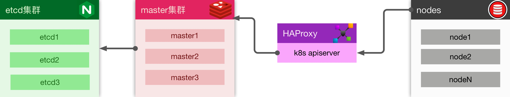

> 高可用集群指 1个lb + 3个master(etcd) + n个node，生产环境都推荐这种安装方式

参考官方文档 [https://kubernetes.io/docs/setup/independent/high-availability/](https://kubernetes.io/docs/setup/independent/high-availability/)



- 新版的k8s，etcd节点已经可以完美和master节点共存于同一台服务器上；
- etcd有3种方式安装（独立安装、docker方式、k8s内部集成）；

虽然k8s集成方式是官方推荐的，但是全是坑，这里还是采用独立安装方式。

## 准备工作
别忘了给每个master起个独立的名字编号(master1, master2, master3)。

服务器|IP|功能
---|---|---
proxy|192.168.0.10|haproxy
master1|192.168.0.11|master, etcd
master2|192.168.0.12|master, etcd
master3|192.168.0.13|master, etcd

在3台master上先执行`kubeadm config images pull` 将初始化需要的镜像预加载下来.
> 1）网络问题，该时间会比较长，可以考虑一台做完以后打个镜像, 或者使用国内镜像加速
> 
> 2）开始如果出现一个取stable-1.txt错误，没有关系

```
[root@master1 ~]# kubeadm config images pull
I1115 15:16:45.196144    2164 version.go:93] could not fetch a Kubernetes version from the internet: unable to get URL "https://dl.k8s.io/release/stable-1.txt": Get https://dl.k8s.io/release/stable-1.txt: net/http: request canceled while waiting for connection (Client.Timeout exceeded while awaiting headers)
I1115 15:16:45.196226    2164 version.go:94] falling back to the local client version: v1.12.2
[config/images] Pulled k8s.gcr.io/kube-apiserver:v1.12.2
[config/images] Pulled k8s.gcr.io/kube-controller-manager:v1.12.2
[config/images] Pulled k8s.gcr.io/kube-scheduler:v1.12.2
[config/images] Pulled k8s.gcr.io/kube-proxy:v1.12.2
[config/images] Pulled k8s.gcr.io/pause:3.1
[config/images] Pulled k8s.gcr.io/etcd:3.2.24
[config/images] Pulled k8s.gcr.io/coredns:1.2.2
```

后面有很多scp操作，为了方便，需要配置master1到master1, master2, master3的免密登陆

```bash
ssh-keygen  # 一路回车即可
scp .ssh/id_rsa.pub master1:

[root@master1 ~]# cat id_rsa.pub >> .ssh/authorized_keys
```

## 安装etcd集群
- 在3台master上安装etcd

```bash
yum install -y etcd
systemctl enable etcd
```

- 生成配置

在master1上操作

```bash
etcd1=192.168.0.11
etcd2=192.168.0.12
etcd3=192.168.0.13

TOKEN=abcd1234
ETCDHOSTS=($etcd1 $etcd2 $etcd3)
NAMES=("infra0" "infra1" "infra2")
for i in "${!ETCDHOSTS[@]}"; do
HOST=${ETCDHOSTS[$i]}
NAME=${NAMES[$i]}
cat << EOF > /tmp/$NAME.conf
# [member]
ETCD_NAME=$NAME
ETCD_DATA_DIR="/var/lib/etcd/default.etcd"
ETCD_LISTEN_PEER_URLS="http://$HOST:2380"
ETCD_LISTEN_CLIENT_URLS="http://$HOST:2379,http://127.0.0.1:2379"
#[cluster]
ETCD_INITIAL_ADVERTISE_PEER_URLS="http://$HOST:2380"
ETCD_INITIAL_CLUSTER="${NAMES[0]}=http://${ETCDHOSTS[0]}:2380,${NAMES[1]}=http://${ETCDHOSTS[1]}:2380,${NAMES[2]}=http://${ETCDHOSTS[2]}:2380"
ETCD_INITIAL_CLUSTER_STATE="new"
ETCD_INITIAL_CLUSTER_TOKEN="$TOKEN"
ETCD_ADVERTISE_CLIENT_URLS="http://$HOST:2379"
EOF
done
```

- 覆盖etcd配置

```bash
for i in "${!ETCDHOSTS[@]}"; do
HOST=${ETCDHOSTS[$i]}
NAME=${NAMES[$i]}
scp /tmp/$NAME.conf $HOST:
ssh $HOST "\mv -f $NAME.conf /etc/etcd/etcd.conf"
rm -f /tmp/$NAME.conf
done
```
- 在每台节点上启动etcd

> master1上执行`service etcd start`，会一直pending状态，等master2的etcd启动以后就会完成。

```bash
[root@master1 ~]# service etcd start
[root@master2 ~]# service etcd start
[root@master3 ~]# service etcd start
```

- 任意节点验证集群

```
etcdctl member list
etcdctl cluster-health
```

## 配置haproxy
使用跳板机做lb

```bash
master1=192.168.0.11
master2=192.168.0.12
master3=192.168.0.13


yum install -y haproxy
systemctl enable haproxy
cat << EOF >> /etc/haproxy/haproxy.cfg
listen k8s-lb *:6443
        mode tcp
        balance roundrobin
        server s1 $master1:6443 weight 1 maxconn 1000 check inter 2000 rise 2 fall 3
        server s2 $master2:6443 weight 1 maxconn 1000 check inter 2000 rise 2 fall 3
        server s3 $master3:6443 weight 1 maxconn 1000 check inter 2000 rise 2 fall 3
EOF
service haproxy start
```

## 安装master集群
- 在master1上初始化集群

```bash
proxy=192.168.0.10
 
etcd1=192.168.0.11
etcd2=192.168.0.12
etcd3=192.168.0.13

master1=$etcd1
master2=$etcd2
master3=$etcd3

cat << EOF > kubeadm-config.yaml
apiVersion: kubeadm.k8s.io/v1alpha3
kind: ClusterConfiguration
kubernetesVersion: stable 
apiServerCertSANs:
- "$proxy"
controlPlaneEndpoint: "$proxy:6443"
etcd:
  external:
    endpoints:
    - "http://$etcd1:2379"
    - "http://$etcd2:2379"
    - "http://$etcd3:2379"
networking:
    podSubnet: "10.244.0.0/16"
EOF

kubeadm init --config kubeadm-config.yaml
```

- 拷贝集群需要的证书到其它master节点

```bash
# make a list of required kubernetes certificate files
cat << EOF > certificate_files.txt
/etc/kubernetes/pki/ca.crt
/etc/kubernetes/pki/ca.key
/etc/kubernetes/pki/sa.key
/etc/kubernetes/pki/sa.pub
/etc/kubernetes/pki/front-proxy-ca.crt
/etc/kubernetes/pki/front-proxy-ca.key
EOF

# create the archive
tar -czf control-plane-certificates.tar.gz -T certificate_files.txt

CONTROL_PLANE_IPS="$master2 $master3"
for host in ${CONTROL_PLANE_IPS}; do
    scp control-plane-certificates.tar.gz $host:
done
```
- 配置其它master节点

到master2, master3上执行如下脚本

```bash
mkdir -p /etc/kubernetes/pki
tar -xzf control-plane-certificates.tar.gz -C /etc/kubernetes/pki --strip-components 3
```
执行master1上生成的`kubeadm join`指令，在指令最后加入参数"–experimental-control-plane"，指令最后类似

```
kubeadm join ha.k8s.example.com:6443 --token 5ynki1.3erp9i3yo7gqg1nv --discovery-token-ca-cert-hash sha256:a00055bd8c710a9906a3d91b87ea02976334e1247936ac061d867a0f014ecd81 --experimental-control-plane
```

- 安装flannel网络插件

在任意master节点上执行

```
kubectl apply -f https://raw.githubusercontent.com/coreos/flannel/master/Documentation/kube-flannel.yml
```

到此集群搭建工作已经完毕，可用如下指令验证集群

```
kubectl get cs      # 查看etcd集群状态
kubectl get pods -o wide -n kube-system # 查看系统服务状态
kubectl get nodes   # 查看集群节点状态
```
