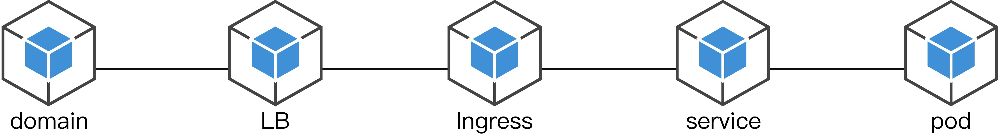
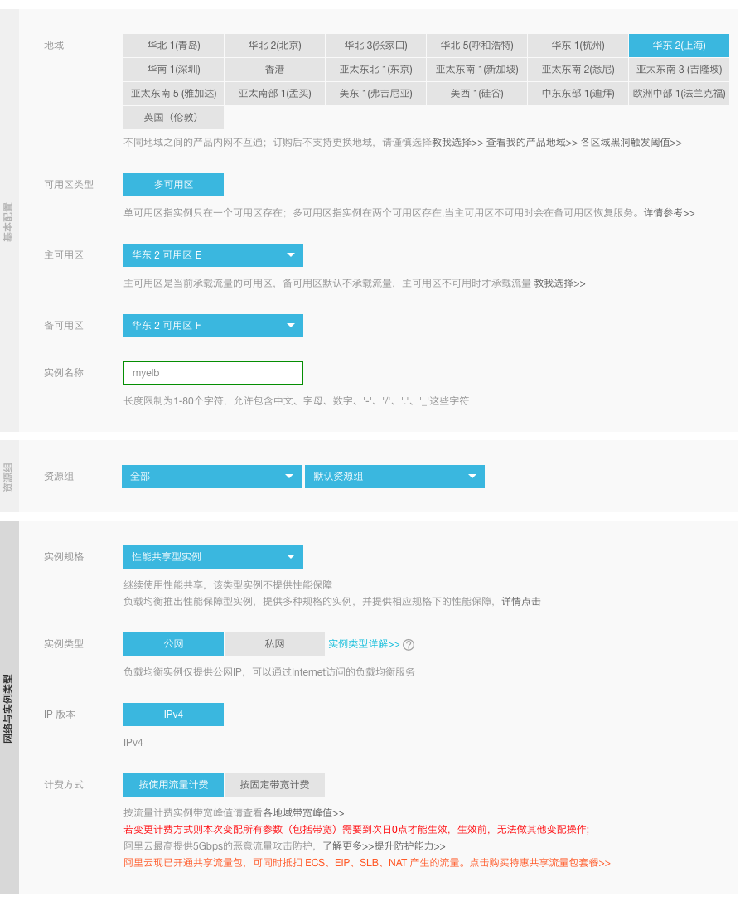
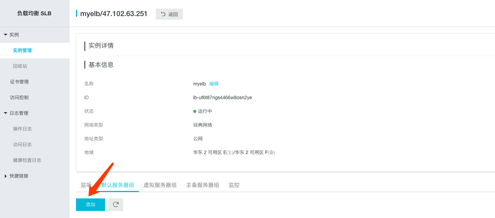
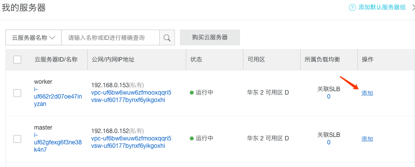
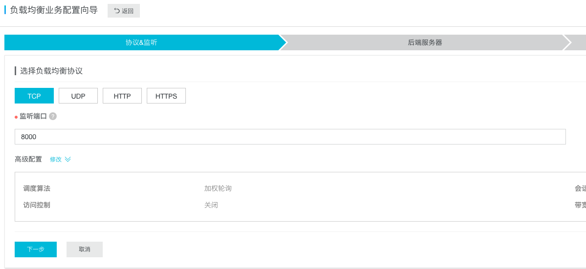
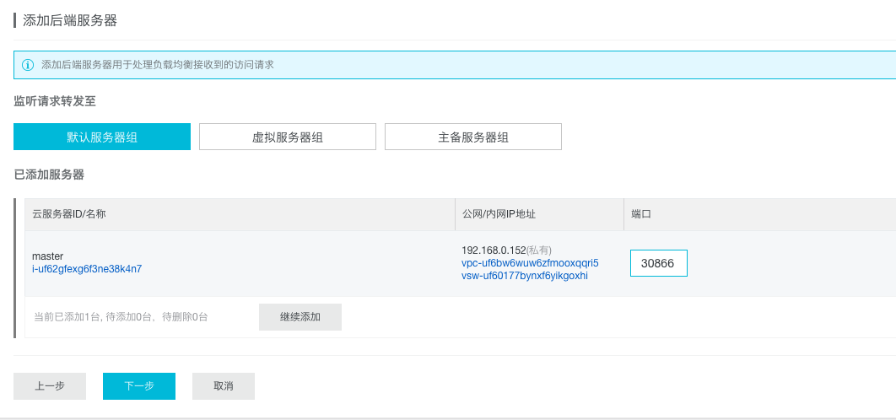

## 准备工作
安装ingress controller

```bash
kubectl apply -f https://raw.githubusercontent.com/kubernetes/ingress-nginx/master/deploy/mandatory.yaml
kubectl apply -f https://raw.githubusercontent.com/kubernetes/ingress-nginx/master/deploy/provider/baremetal/service-nodeport.yaml
```

## 创建pod
- mytest.yaml

```bash
apiVersion: apps/v1
kind: Deployment    # 旧版使用 ReplicationController
metadata:
  name: mypod       # pod标识，kubectl get pods 显示
spec:
  selector:
    matchLabels:
      app: myapp    # pod想选取的应用标识，服务也是选取这个
  replicas: 1       # 需要创建几个pod
  template:
    metadata:
      labels:
        app: myapp  # 应用标识
    spec:
      containers:
      - name: mycontainer   # pod内部的容器标识，和外部无关
        image: dingzhihong/mytest   # docker镜像地址
```
- 创建 & 验证

```
[root@master ~]# kubectl delete -f mytest.yaml 
deployment.apps "mypod" deleted

[root@master ~]# kubectl apply -f mytest.yaml
deployment.apps/mypod created

[root@master ~]# kubectl get pods -o wide
NAME                     READY   STATUS    RESTARTS   AGE   IP           NODE     NOMINATED NODE
mypod-5968dcdd64-zrrsw   1/1     Running   0          22s   10.244.1.8   worker   <none>

[root@master ~]# curl http://10.244.1.8:8000
<h1>Hello World!</h1>
```

## 创建service
- mytest-service.yaml

```bash
apiVersion: v1
kind: Service
metadata:
  name: myservice       # 服务标识
spec:
  type: NodePort        # 服务类型，官方推荐
  ports:
  - port: 8001          # 映射的服务端口
    targetPort: 8000    # 绑定的pod端口，(default: port)
    nodePort: 30001     # 映射的节点端口，(default: random 30000-32767)
  selector:
    app: myapp          # 服务绑定的pod
```
- 创建 & 验证

```
[root@master ~]# kubectl apply -f mytest-service.yaml 
service/myservice created

[root@master ~]# kubectl get service
NAME         TYPE        CLUSTER-IP      EXTERNAL-IP   PORT(S)          AGE
kubernetes   ClusterIP   10.96.0.1       <none>        443/TCP          18h
myservice    NodePort    10.102.114.10   <none>        8001:30001/TCP   6m50s

[root@master ~]# curl http://192.168.0.153:30001
<h1>Hello World!</h1>

[root@master ~]# curl http://10.102.114.10:8001
<h1>Hello World!</h1>
```
> 192.168.0.153是该pod所在节点的IP地址

## 创建ingress
- mytest-ingress.yaml

```bash
apiVersion: extensions/v1beta1
kind: Ingress
metadata:
  name: myingress
  annotations:
    nginx.ingress.kubernetes.io/rewrite-target: /
    nginx.ingress.kubernetes.io/ssl-redirect: "false"
spec:
  rules:
  - http:
      paths:
      - path: /helloworld
        backend:
          serviceName: myservice
          servicePort: 8001
```
- 创建 & 验证

```bash
[root@master ~]# kubectl create -f mytest-ingress.yaml 
ingress.extensions/myingress created

[root@master ~]# kubectl get ingress
NAME        HOSTS   ADDRESS   PORTS   AGE
myingress   *                 80      16s

[root@master ~]# kubectl get pod -n ingress-nginx -o wide
NAME                                       READY   STATUS    RESTARTS   AGE   IP           NODE     NOMINATED NODE
nginx-ingress-controller-76f97b74b-tq7nv   1/1     Running   0          16h   10.244.1.5   worker   <none>

[root@master ~]# kubectl get service -n ingress-nginx
NAME            TYPE       CLUSTER-IP       EXTERNAL-IP   PORT(S)                      AGE
ingress-nginx   NodePort   10.111.207.114   <none>        80:30866/TCP,443:32360/TCP   16h

[root@master ~]# curl http://192.168.0.153:30866/helloworld/
<h1>Hello World!</h1>
```
> 192.168.0.153是集群内任意节点的IP地址

## 创建LB
- 创建负载均衡

- 配置服务器



- 配置LB端口

- 配置服务器端口


最后的收尾工作是将LB绑定到一个固定域名，通过浏览器访问验证。

实际生产环境的小技巧：
> 1. ingress-controller重启，nodeport是会变的，真正的生成环境我们需要将端口固定住；
>
> 2. 有时候我们会需要把某些pod限制在某几个指定节点上，我们需要通过给node加标签来固定；
> 
> 3. 牵涉到与微信开放平台通讯时，那边会需要咱们固定IP访问接口，这种情况下我们不光要把负责通讯的应用固定在指定节点上，指定节点也要分配固定的弹性IP。