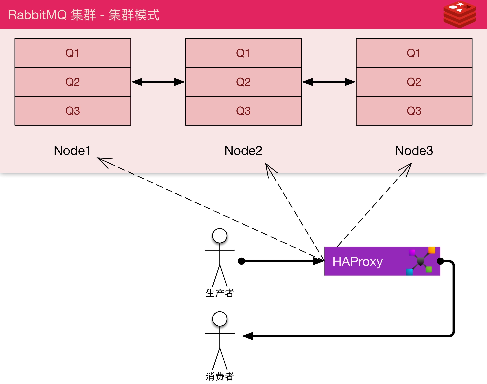

> 集群模式



> 路由模式


## 安装
服务器分别命名mq1, mq2, mq3

```
cat << EOF > /etc/yum.repos.d/rabbitmq-erlang.repo
[rabbitmq-erlang]
name=rabbitmq-erlang
baseurl=https://dl.bintray.com/rabbitmq/rpm/erlang/21/el/7
gpgcheck=1
gpgkey=https://dl.bintray.com/rabbitmq/Keys/rabbitmq-release-signing-key.asc
repo_gpgcheck=0
enabled=1
EOF
yum install -y socat erlang
rpm -Uvh https://dl.bintray.com/rabbitmq/all/rabbitmq-server/3.7.7/rabbitmq-server-3.7.7-1.el7.noarch.rpm
systemctl enable rabbitmq-server
service rabbitmq-server start
```
## 配置 & 调优

```
username=dingding
password=dingding1234

rabbitmq-plugins enable rabbitmq_management
rabbitmqctl add_user ${username} ${password}
rabbitmqctl set_user_tags ${username} administrator
rabbitmqctl set_permissions -p / ${username} ".*" ".*" ".*"
mkdir /etc/systemd/system/rabbitmq-server.service.d/
cat << EOF > /etc/systemd/system/rabbitmq-server.service.d/limits.conf
[Service]
LimitNOFILE=300000
EOF
systemctl daemon-reload
service rabbitmq-server restart
rabbitmqctl cluster_status
```
## 集群组建
- 在mq2, mq3上执行

```
mq1=192.168.0.111   # 修改为真实IP

rabbitmqctl stop_app
rabbitmqctl join_cluster rabbit@mq1
rabbitmqctl start_app
```

- 设置策略

> 系统默认路由模式，任意节点执行如下代码则切换到集群模式

```
rabbitmqctl set_policy ha-all "^" '{"ha-mode":"all"}'
```

## LB
建议将mq1, mq2, mq3写在 /etc/hosts里面

```bash
# /etc/haproxy/haproxy.cfg
listen  mq *:5672
    mode tcp
    balance     roundrobin
    timeout client  3h
    timeout server  3h
    option          clitcpka
    server _1 mq1:5672 check inter 5s rise 2 fall 3
    server _2 mq2:5672 check inter 5s rise 2 fall 3
    server _3 mq3:5672 check inter 5s rise 2 fall 3
listen mq-web *:15672
    mode http
    balance     roundrobin
    server _1 mq1:15672
    server _2 mq2:15672
    server _3 mq3:15672
```