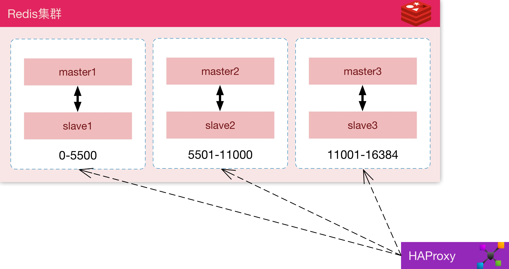

> redis从5开始已经废弃了使用ruby脚本创建集群，而将创建集群指令直接集成在了redis-cli里面

生产环境建议采用 3master + 3slave 总共6台独立服务器搭建

## 安装
- 安装版本v5

```bash
yum install -y http://rpms.famillecollet.com/enterprise/remi-release-7.rpm
yum --enablerepo=remi install redis
systemctl enable redis
```
- 修改配置，切换到集群模式

```bash
# /etc/redis.conf
bind 127.0.0.1 ::1
cluster-enabled yes
```
- 启动

```
service redis start
```

## 创建集群
任意节点下执行

```
redis1=192.168.0.11
redis2=192.168.0.12
redis3=192.168.0.13
redis1-slave=192.168.0.14
redis2-slave=192.168.0.15
redis3-slave=192.168.0.16

redis-cli --cluster create ${redis1} ${redis2} ${redis3} ${redis1-slave} ${redis2-slave} ${redis3-slave} --cluster-replicas 1
```
## 安装监控
- 安装脚本

```
yum install -y ruby ruby-devel gcc gcc-c++
gem sources --add https://gems.ruby-china.com/ --remove https://rubygems.org/
gem install -y redis-stat

```
- 启动脚本

```
redis-stat redis1 redis2 ...  --server --daemon
```
> 建议将6台服务器地址写入/etc/hosts

> 参数 --server --daemon 是后台模式运行

- 指标参数清单

简写|	指标|	说明
---|---|---
us|	used_cpu_user|	用户空间占用CPU百分比
sy|	used_cpu_sys|	内核空间占用CPU百分比
cl|	connected_clients|	连接客户端数量
bcl|	blocked_clients|	阻塞客户端数量(如BLPOP)
mem|	used_memory|	使用总内存
rss|	used_memory_rss|	使用物理内存
keys|	dbx.keys|	key的总数量
cmd/s|	command/s|	每秒执行命令数
exp/s|	expired_keys/s|	每秒过期key数量
evt/s|	evicted_keys/s|	每秒淘汰key数量
hit%/s|	keyspace_hitratio/s|	每秒命中百分比
hit/s|	keyspace_hits/s|	每秒命中数量
mis/s|	keyspace_miss/s|	每秒丢失数量
aofcs|	aof_current_size|	AOF日志当前大小

## LB

```bash
# /etc/haproxy/haproxy.cfg

listen  redis *:6379
    mode tcp
    balance     roundrobin
    timeout client  3h
    timeout server  3h
    option          clitcpka
    server _1 redis1:6379 check inter 5s rise 2 fall 3
    server _2 redis2:6379 check inter 5s rise 2 fall 3
    server _3 redis3:6379 check inter 5s rise 2 fall 3
    server _4 redis1-slave:6379 check inter 5s rise 2 fall 3
    server _5 redis2-slave:6379 check inter 5s rise 2 fall 3
    server _6 redis3-slave:6379 check inter 5s rise 2 fall 3
```

## 性能分析方法

- 压测方法

```
redis-benchmark -t set,get -n 100000 -h {addr}
```
> 8w/s为good

- 延时分析

```
redis-cli --latency -h {addr}
```
> avg稳定在0.3-0.4为good

- 慢查询分析

```
:6379> slowlog get 
```
